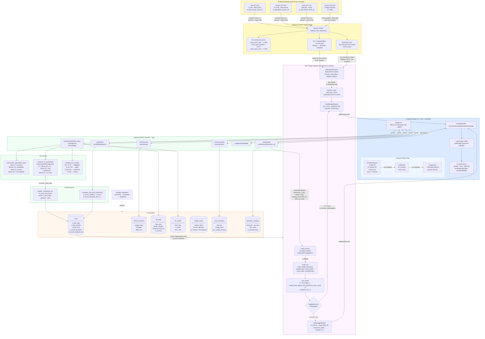

# AdaptiveUI — System Architecture

## Overview

AdaptiveUI is a closed-loop clinical decision-support system that measures implicit bias across three demographic dimensions (age, gender, race) via sequential Implicit Association Tests, calibrates individual motor baselines, then delivers adaptive nudges during triage decision-making based on a Rough Set Theory classifier.

---

## Full Architecture Diagram



---

## Data Flow Summary

| Phase | Trigger | Key path |
|-------|---------|----------|
| **Startup** | Server boot | Datasets → `dataset_loader` → priors + IS seed pool + bootstrap rules |
| **Boot** | App load | `GET /profile` + `POST /session/start` → Zustand store |
| **Age IAT** | Mount | `GET /iat/blocks?bias_type=age` → 7 blocks → `POST /iat/response` × N → `POST /iat/complete` → `s_bias_age` stored |
| **Gender IAT** | Age complete | Same flow with `bias_type=gender` → `s_bias_gender` stored |
| **Race IAT** | Gender complete | Same flow with `bias_type=race` → `s_bias_race` stored |
| **Calibration** | IAT complete | Mouse movement → `POST /profile/baseline` → `d_score_baseline` stored |
| **Triage** | Calibration complete | Each mouse window → WebSocket → RST pipeline → P computed → nudge pushed back via WebSocket |
| **Nudge** | P threshold crossed | WebSocket hard/soft nudge → frontend modal/highlight → `POST /nudge/acknowledge` |

---

## Risk Model

```
P = W_fatigue × max(|s_bias_age|, |s_bias_gender|, |s_bias_race|) / 2

where:
  W_fatigue ∈ [0, 1]   — exponentially-weighted kinematic fatigue signal
  s_bias_*  ∈ [-2, 2]  — Greenwald D-score per IAT dimension
  P         ∈ [0, 1]   — probability of bias-influenced decision

Hard nudge:  P ≥ 0.6 AND case is_counter_stereotypical
Soft nudge:  0.3 ≤ P < 0.6
```

---

## ML Engine (RST)

The Rough Set Theory engine operates per clinical session:

1. **Cold start** — IS seeded with 50 labelled objects from the fatigue dataset (mapped from cognitive features to kinematic attributes). Bootstrap rules loaded from JSON cache.
2. **Per window** — `LabeledObject` added to IS; equivalence classes recomputed.
3. **Classification** — once IS has ≥ 6 objects, live rule induction replaces bootstrap rules.
4. **Explanation** — `generate_rules()` produces natural-language evidence strings for the hard nudge modal.

Population priors (loaded from Project Implicit data, first 50 k rows):

| Dimension | Prior | Source column |
|-----------|-------|---------------|
| Age | 0.500 | `D_biep.Young_Good_all` |
| Gender | 0.373 | `D_biep.Male_Career_all` |
| Race | 0.256 | `D_biep.White_Good_all` |
